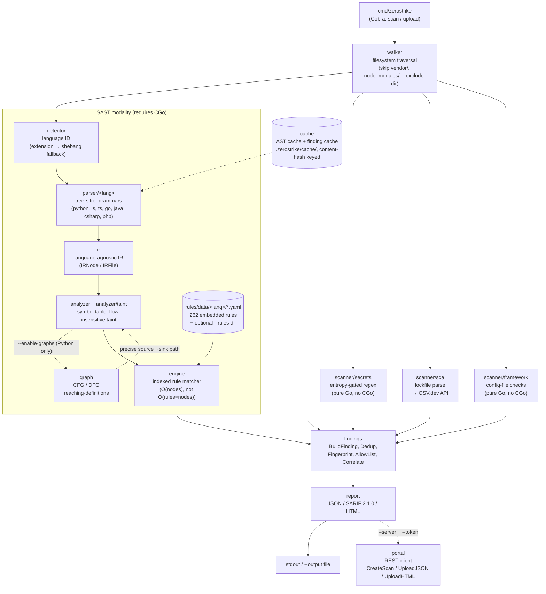

# ZeroStrike

**A self-contained, multi-language Static Application Security Testing (SAST) engine written in Go — one static binary, four scanning modalities, zero third-party scanning engines.**

[](https://github.com/Mohamedashmar432/zero-strike-SAST-engine/actions/workflows/ci.yml)
[](https://github.com/Mohamedashmar432/zero-strike-SAST-engine/actions/workflows/release.yml)


ZeroStrike walks a repository, parses it with [tree-sitter](https://tree-sitter.github.io/tree-sitter/) into a language-agnostic IR, matches that IR against a rule engine, and layers secrets/dependency/framework-misconfiguration scanning on top — all inside a single Go binary with no external scanner processes, no rule-pack downloads, and no mandatory cloud dependency.

---

## Table of Contents

- [Why ZeroStrike](#why-zerostrike)
- [Key Features](#key-features)
- [Architecture Overview](#architecture-overview)
- [How It Works](#how-it-works)
- [Supported Languages & Vulnerability Coverage](#supported-languages--vulnerability-coverage)
- [Installation](#installation)
- [Quick Start](#quick-start)
- [CLI Reference](#cli-reference)
- [Output Formats](#output-formats)
- [Writing Custom Rules](#writing-custom-rules)
- [Suppressing Findings](#suppressing-findings)
- [Caching](#caching)
- [CI/CD Integration](#cicd-integration)
- [Accuracy Benchmarking](#accuracy-benchmarking)
- [How ZeroStrike Compares](#how-zerostrike-compares)
- [Known Limitations & Roadmap](#known-limitations--roadmap)
- [Project Layout](#project-layout)
- [Contributing](#contributing)
- [License](#license)

---

## Why ZeroStrike

Most SAST setups in the wild are actually two or three tools stitched together: a code scanner, a secrets scanner, and a dependency (SCA) scanner, each with its own config format, its own binary, its own false-positive tuning, and often a phone-home to a vendor's cloud for rule updates or "premium" detections.

ZeroStrike takes the opposite bet: **one Go binary, four scanning modalities, one report.** It embeds its rule set at compile time (`go:embed`), embeds tree-sitter grammars via CGo, and ships as a single static-ish executable per OS/arch. There is no separate rules repository to `git clone`, no daemon to run, and no license server to reach — the engine is fully usable air-gapped (only the optional SCA modality calls out to the public OSV.dev API, and only when `--enable-sca` is set).

## Key Features

- **7 languages, one IR** — Python, JavaScript, TypeScript, Go, Java, C#, and PHP are parsed by tree-sitter into a shared Intermediate Representation, so the rule engine and taint analyzer are written once, not once per language.
- **Four independent scanning modalities**, run concurrently in a single pass over the filesystem:
  - **SAST** — tree-sitter → IR → rule engine, with lightweight file-scoped taint tracking.
  - **Secrets** — entropy-gated regex detectors (AWS keys, GitHub tokens, generic API keys, hardcoded passwords, PEM private keys).
  - **SCA** — lockfile parsing (npm/yarn/pnpm/pip/Go/Maven) cross-referenced against the [OSV.dev](https://osv.dev/) vulnerability database.
  - **Framework misconfiguration** — config-file checks for Django, Express, Laravel, Spring, ASP.NET, and raw CORS/`php.ini` settings — no parsing required.
- **Optional path-sensitive taint analysis** — a CFG/DFG (control-flow / data-flow graph) layer for Python attaches an exact source→sink path to a finding when `--enable-graphs` is set.
- **Indexed rule engine** — rules are pre-grouped by IR node kind and callee at startup, so matching is `O(nodes)` rather than `O(rules × nodes)`.
- **Stable, content-based fingerprints** — every finding's `Fingerprint` is a hash of the rule ID, enclosing symbol, and normalized code snippet (deliberately excluding line/column), so it survives unrelated code churn — the same bug doesn't reopen as a "new" finding after a reformat.
- **Taint-chain correlation** — findings in the same file that trace back to the same tainted source variable (e.g. one unsanitized input reaching both a path-traversal read and a command-injection sink) are linked via `Finding.Metadata["chain_id"/"chain_size"/"chain_rules"]`, surfaced in the HTML report as a single attack chain instead of unrelated line items.
- **Three report formats** — JSON (flat or grouped), **SARIF 2.1.0** (drop-in for GitHub Code Scanning), and a self-contained HTML report — all three carry CWE/OWASP tags, rule rationale/description/remediation text, the matched code snippet, and taint source→sink context when available.
- **Content-addressed caching** — parsed IR and computed findings are cached under `<root>/.zerostrike/cache/`, automatically invalidated on rule-set, engine version, or IR-schema changes. Cache failures degrade to a slower scan, never a wrong one.
- **Allowlist-based suppression** — `.zs-allow.yaml` suppresses by exact fingerprint, by rule + path glob, or by rule alone.
- **Deterministic exit codes** for CI gating: `0` clean, `1` findings present, `2` engine/upload error.
- **Optional portal upload** — `scan --server --token` or the standalone `upload` subcommand push a report to a companion "zero-strike-portal" backend over a small, retrying REST client — entirely opt-in.
- **Apache-2.0** licensed engine (see [License](#license)).

## Architecture Overview



Everything above the `SAST modality` box is shared infrastructure; everything inside it is the tree-sitter/IR/taint/rule-engine pipeline, which is the only part gated behind CGo. The three other scanners (secrets, SCA, framework) are pure Go and keep working even in a `CGO_ENABLED=0` build — only SAST detection goes silent, and the CLI prints an explicit warning when that happens.

## How It Works

1. **Walk** — `internal/walker` traverses the target path once, skipping `vendor/`, `node_modules/`, and any user-supplied `--exclude-dir`, producing a flat list of file entries.
2. **Detect** — `internal/detector` identifies each file's language from its extension, falling back to a shebang-line check for extensionless scripts.
3. **Parse** — each language's `internal/parser/<lang>` package (CGo + tree-sitter) parses the file into a CST, then a `builder.go` lowers that CST into ZeroStrike's own **IR** (`internal/ir`) — the single representation every rule and analysis pass consumes, regardless of source language.
4. **Analyze** — `internal/analyzer` builds a symbol table (`internal/symboltable`) and runs a lightweight, file-scoped, regex-driven **taint pass** (`internal/analyzer/taint`) that classifies sources/sanitizers per language and tracks same-file call summaries. With `--enable-graphs` (Python only, currently), `internal/graph` builds a real CFG/DFG and attaches a precise source→sink path to taint-dependent findings.
5. **Match** — `internal/engine` matches the IR against the active rule set. Rules are pre-indexed by node kind and callee at load time so a scan is `O(files × nodes)`, not `O(files × nodes × rules)`.
6. **Scan (parallel modalities)** — independently of the SAST path, `internal/scanner/secrets`, `internal/scanner/sca`, and `internal/scanner/framework` each implement a common `Scanner` interface and run concurrently over the same file list, contributing their own findings.
7. **Build findings** — `internal/findings` normalizes every hit from every modality into a common `core.Finding`, computes its stable content-hash `Fingerprint`, deduplicates exact repeats, applies `.zs-allow.yaml` suppressions, then runs `findings.Correlate` to link same-file findings sharing a tainted source variable into an attack chain (`chain_id`/`chain_size`/`chain_rules` in `Finding.Metadata`).
8. **Cache** — IR and per-file findings are cached under `<root>/.zerostrike/cache/`, keyed by file content hash plus a fingerprint of the active rule set, engine version, and IR schema — any of those changing invalidates the cache automatically. A cache miss or corrupt cache file never fails the scan, it just costs the re-parse.
9. **Report** — `internal/report/{json,sarif,html}` renders the collected findings as flat or grouped JSON, GitHub-Code-Scanning-ready SARIF 2.1.0, or a self-contained HTML page.
10. **(Optional) Upload** — if `--server`/`--token` are set, `internal/portal` registers the scan, uploads the JSON (and optionally HTML) report to a companion portal backend, and marks the scan `failed` if the pipeline errored — all as a strictly additive step that never blocks the local report.

## Supported Languages & Vulnerability Coverage

| Language | Grammar | Embedded rules | Example categories |
|---|---|---|---|
| Python | `tree-sitter-python` | 55 | injection, deserialization (`pickle`/`marshal`/`dill`/`yaml.load`), zip-slip, SSRF, SSTI, XXE, LDAP/NoSQL injection, log injection, crypto, framework debug flags |
| JavaScript | `tree-sitter-javascript` | 46 | XSS, SSRF, SSTI (`ejs`/`pug`), NoSQL injection, prototype pollution, CORS misconfiguration, command injection (`spawn`/`execFile`/`fork`/`execSync`), path traversal, ReDoS, insecure crypto, JWT bypass |
| TypeScript | `tree-sitter-typescript` | 46 | mirrors the JavaScript rule set 1:1 |
| Go | `tree-sitter-go` | 28 | command injection, path traversal, TLS/cert-verification bypass, SSRF, insecure file permissions, format-string injection, weak crypto |
| C# | `tree-sitter-c-sharp` | 27 | injection, deserialization (`TypeNameHandling`), XXE, XPath/LDAP injection, weak crypto, SSRF, JWT bypass, CORS/ASP.NET misconfig |
| Java | `tree-sitter-java` | 34 | injection, XPath/LDAP/JNDI injection, unsafe reflection, deserialization (`XMLDecoder`/`XStream`/SnakeYAML), SSRF, CORS/Spring misconfig |
| PHP | `tree-sitter-php` | 26 | injection (`eval`/`exec`/`passthru`/`assert`), mass assignment, path traversal, XXE, SSRF, weak crypto, Laravel/`php.ini` misconfig |

Across all 262 rules, the most common categories are **injection** (SQLi, command injection, SSTI, XPath/LDAP/NoSQL/JNDI injection), **security misconfiguration**, **cryptography** (weak hashes/ciphers/random/TLS), **path traversal** (including zip-slip and arbitrary file write), **authentication** (hardcoded credentials, JWT bypass), **XSS**, **SSRF**, **insecure deserialization**, plus smaller categories for XXE, prototype pollution, unsafe reflection, format-string injection, log injection, mass assignment, ReDoS, and dangerous-function usage (`eval`, `exec`).

Layered on top, independent of language parsing:

- **Secrets** (5 detectors): AWS access keys, GitHub tokens, generic API keys (entropy-gated), hardcoded passwords (entropy-gated), PEM private key blocks.
- **SCA**: npm (`package-lock.json`/`yarn.lock`/`pnpm-lock.yaml`), Python (`Pipfile.lock`, `requirements*.txt`), Go (`go.mod`), Maven (`pom.xml`) — queried in batch against OSV.dev.
- **Framework misconfiguration**: Django `DEBUG`, Express missing Helmet, wildcard CORS, Laravel debug/session/CSRF settings, Spring actuator exposure, ASP.NET verbose errors/directory browsing, PHP cookie flags.

> All SAST parsing requires **CGo** (tree-sitter is a C library). A `CGO_ENABLED=0` build registers zero language parsers — the CLI prints an explicit warning and SAST findings go silent, but secrets/SCA/framework checks are pure Go and keep working.

## Installation

### Prebuilt binaries (recommended)

Download the binary for your platform from the [Releases page](https://github.com/Mohamedashmar432/zero-strike-SAST-engine/releases) — `zerostrike_<os>_<arch>` for `linux/amd64`, `linux/arm64`, `windows/amd64`, `darwin/amd64`, and `darwin/arm64`, each built with `CGO_ENABLED=1` so every language parser is active out of the box. Verify against the release's `checksums.txt`.

### Build from source

Requires Go 1.26+ and a C compiler on `PATH` (gcc/clang/mingw) for CGo:

```bash
git clone https://github.com/Mohamedashmar432/zero-strike-SAST-engine.git
cd zero-strike-SAST-engine
make build            # plain build → ./zerostrike
make build-release    # stamps the binary with `git describe` as its version
```

Without a C compiler, `go build ./cmd/zerostrike` still succeeds (`CGO_ENABLED=0`), but SAST detection is disabled — see the warning above.

### `go install`

```bash
CGO_ENABLED=1 go install github.com/Mohamedashmar432/zero-strike-SAST-engine/cmd/zerostrike@latest
```

## Quick Start

```bash
# Scan a directory, human-readable JSON to stdout
zerostrike scan ./myrepo

# Turn on every modality, write SARIF for GitHub Code Scanning
zerostrike scan ./myrepo \
  --enable-secrets --enable-sca --enable-framework-checks \
  --format sarif --output results.sarif

# Restrict to specific languages, group the JSON report by severity
zerostrike scan ./myrepo --lang python --lang javascript --group-by severity

# Python-only path-sensitive taint (CFG/DFG) reporting
zerostrike scan ./myrepo --enable-graphs

# Upload a scan straight to a self-hosted ZeroStrike portal
zerostrike scan ./myrepo --server https://portal.internal --token $ZS_TOKEN
```

Exit codes are designed to gate CI directly: `0` = clean, `1` = findings present, `2` = engine or upload error.

## CLI Reference

### `zerostrike scan <path>`

| Flag | Default | Description |
|---|---|---|
| `-f, --format` | `json` | `json`, `sarif`, or `html` |
| `-o, --output` | stdout | output file path |
| `--lang` | auto-detect | repeatable; restrict to specific languages |
| `--rules` | embedded | external rules directory (same YAML schema) |
| `--no-cache` | `false` | disable AST/finding cache |
| `--workers` | `NumCPU` | worker count |
| `--enable-secrets` | `false` | enable the secrets scanner |
| `--enable-sca` | `false` | enable the OSV-backed SCA scanner |
| `--enable-framework-checks` | `false` | enable framework misconfiguration checks |
| `--enable-graphs` | `false` | CFG/DFG path-sensitive taint reporting (Python only) |
| `--sca-on-error` | `warn` | `warn` or `fail` on SCA network error |
| `--allow-file` | `<root>/.zs-allow.yaml` | path to the suppression allowlist |
| `--exclude-dir` | — | repeatable; extra directory names to skip |
| `--group-by` | none | `file`, `rule`, `severity`, or `language` |
| `--server` / `--token` | — | portal base URL / project token, enables upload together |
| `--scan-label` | — | optional label shown in the portal |

### `zerostrike upload`

Uploads a previously generated report (must have been rendered with `--group-by` unset, since the grouped JSON shape drops the flat findings array):

| Flag | Required | Description |
|---|---|---|
| `--report` | yes | path to a JSON report from `scan` |
| `--html` | no | path to an HTML report from `scan` |
| `--server` | yes | portal base URL |
| `--token` | yes | portal project token |
| `--scan-label` | no | optional label |

Both commands accept a deprecated, silently-ignored `--project-id` (kept as a no-op for older CI configs — the project token alone determines the project).

## Output Formats

**JSON** — one `core.Finding` per hit, with rule ID, category, severity/confidence, exact `Location`, CWE/OWASP tags, a stable `Fingerprint`, `Rationale`/`Remediation` text, and a modality-specific payload (`Secret`, `Dependency`, `Config`, or `TaintContext`) when applicable:

```json
{
  "RuleID": "ZS-PY-001",
  "RuleName": "Dangerous eval() Usage",
  "Category": "dangerous-functions",
  "Severity": "high",
  "Confidence": "high",
  "Message": "Dangerous call to eval() — replace with ast.literal_eval() for safe parsing",
  "Location": { "File": "app/handlers.py", "Line": 42, "Column": 9 },
  "Language": "python",
  "CWE": ["CWE-95"],
  "OWASP": ["A05:2025"],
  "Fingerprint": "9a3f2c1b7e5d4a10",
  "Rationale": "eval() compiles and executes its argument as arbitrary Python source...",
  "Description": "Detects calls to the eval() builtin. The rule does not perform taint tracking...",
  "Remediation": "Use ast.literal_eval() instead of eval() when parsing user data.",
  "Metadata": { "chain_id": "3d93098bb583", "chain_size": "2", "chain_source": "cmd", "chain_rules": "ZS-PY-012,ZS-PY-013" }
}
```

`Metadata`'s `chain_*` keys are only present when `findings.Correlate` linked this finding to others in the same file via a shared tainted source variable (see [Key Features](#key-features)).

**SARIF 2.1.0** — one `sarifRule` per distinct rule ID (with `fullDescription`/`help` built from the rule's rationale, remediation, and full reference list), CWE/OWASP formatted as SARIF taxonomy tags, a `region.snippet` carrying the matched code, and a `partialFingerprints["zerostrikeFingerprint/v1"]` carrying the same stable fingerprint — designed to upload directly via `github/codeql-action/upload-sarif`.

**HTML** — a single self-contained report file for humans, groupable the same way as JSON, with CWE/OWASP/category/confidence tags, the matched code snippet, taint source→sink flow, and taint-chain badges rendered per finding.

## Writing Custom Rules

Rules are typed YAML (not a free-form pattern DSL — typed fields prevent `map[string]interface{}` schema drift), embedded at build time from `internal/rules/data/<lang>/*.yaml`, and can be overridden or extended with `--rules <dir>` pointing at a directory using the same schema:

```yaml
id: ZS-PY-001
lifecycle: released
name: Dangerous eval() Usage
version: "1.0.0"
language: python
category: dangerous-functions
severity: high
confidence: high
cwe: [CWE-95]
owasp: ["A05:2025"]
rationale: |
  eval() compiles and executes its argument as arbitrary Python source...
message: "Dangerous call to eval() — replace with ast.literal_eval() for safe parsing"
tags: [rce, injection, eval]
match:
  kind: call
  callee: eval
fix_suggestion: "Use ast.literal_eval() instead of eval() when parsing user data."
```

`match` supports `kind`, `callee`/`callee_suffix` (dot-boundary suffix match, e.g. any `*.Response.Write`), `identifier`, `literal`, `lhs_identifier`/`rhs_literal` for assignment patterns. Optional `filters` narrow a match further: `argument_count`, `has_attribute`, `tainted_argument`, `tainted_rhs`, `kwarg`, `argument_identifier_matches`, `has_bare_except`, `has_empty_except_handler`, and a `not` combinator.

## Suppressing Findings

`.zs-allow.yaml`, auto-discovered at `<scan-root>/.zs-allow.yaml` (or pointed at via `--allow-file`):

```yaml
version: "1"
suppressions:
  - fingerprint: "9a3f2c1b7e5d4a10"   # exact-instance suppression
    reason: "reviewed, not exploitable — internal admin-only endpoint"
  - id: ZS-SEC-003                    # rule-wide suppression
    path: "**/testdata/**"            # optional glob, scoped to this rule
    reason: "test fixtures only"
```

Matching precedence: exact fingerprint → rule ID + path glob → rule ID alone (blanket suppression).

## Caching

Every scan writes to `<root>/.zerostrike/cache/`: an **AST cache** (serialized IR, avoids re-parsing unchanged files) and a **finding cache** (JSON blobs keyed by content hash, avoids re-matching unchanged files against an unchanged rule set). A `meta.json` records the engine version, rule-set hash, and IR schema version — changing any of them invalidates the whole cache automatically. Disable with `--no-cache`; a cache-open failure silently falls back to no caching rather than failing the scan.

## CI/CD Integration

> **Exit code `1` means "findings were found" — not a scan failure.** Always tolerate it explicitly (`|| [ $? -eq 1 ]`) and only let exit code `2` (a real engine/upload error) fail the job. Omitting this is the most common reason a first CI run "fails" unexpectedly — see [Quick Start](#quick-start).

This repository's own [`.github/workflows/ci.yml`](.github/workflows/ci.yml) is a working example:

- **lint** — `go vet ./...` + build
- **test** — a 3-way matrix: Ubuntu with CGo, Ubuntu without CGo, Windows without CGo
- **scan-e2e** — installs `zerostrike` and scans six known-vulnerable public apps (DVNA, DVPWA, DVWA, damn-vulnerable-golang, Vulnerable-Flask-App, Damn-Vulnerable-dotNet-Application) with `--enable-sca --enable-secrets`, in both JSON and HTML, uploading the reports as artifacts
- **accuracy** — runs the benchmark harness (see below) and gates on `--min-recall 0.90 --max-fp 0`
- **cache-perf** — informational cold-vs-warm timing comparison, non-gating

[`.github/workflows/release.yml`](.github/workflows/release.yml) builds native `goreleaser` jobs per OS (Linux/Windows/macOS, since GoReleaser OSS can't merge cross-OS CGo builds) on `v*.*.*` tags, then checksums and publishes via `gh release create`.

A minimal drop-in for your own repo:

```yaml
- name: Download ZeroStrike
  run: |
    curl -sL https://github.com/Mohamedashmar432/zero-strike-SAST-engine/releases/latest/download/zerostrike_linux_amd64 -o zerostrike
    chmod +x zerostrike

- name: Scan
  run: |
    ./zerostrike scan . --enable-secrets --enable-sca --format sarif --output results.sarif || [ $? -eq 1 ]

- name: Upload SARIF to GitHub Code Scanning
  if: always()
  uses: github/codeql-action/upload-sarif@v3
  with:
    sarif_file: results.sarif
```

If you're pushing to a self-hosted portal with `--server`/`--token` instead of (or alongside) SARIF/Code Scanning, pair `--output` with the same exit-code guard. Without `--output` the report renders straight to stdout — dumping the full JSON into your CI log — and without `|| [ $? -eq 1 ]` the step fails on the very first finding:

```yaml
- name: Scan and upload to portal
  run: |
    ./zerostrike scan . --server https://portal.internal --token ${{ secrets.ZS_TOKEN }} \
      --output results.json || [ $? -eq 1 ]
```

## Accuracy Benchmarking

`cmd/zerostrike-bench` scores the engine against a labeled fixture corpus in `benchmark/corpus/` (one `manifest.yaml` + `cases/` per language, plus dedicated corpora for secrets/SCA/framework), computing true/false positive and negative counts and precision/recall — replacing prose-based QA with numbers that can be diffed release over release:

```bash
go build -o zerostrike-bench ./cmd/zerostrike-bench
./zerostrike-bench --corpus benchmark/corpus --min-recall 0.90 --max-fp 0 \
  --json-out benchmark-report.json --md-out accuracy-report.md
```

The CI `accuracy` job runs this on every push and fails the build if recall drops below 90% or any false positive appears in the corpus. Current corpus result: **TP=299, FP=0, FN=0 — 100% precision/recall**. Documented v1 gaps: three Python taint-gated rules pending same-file taint fixes, SCA limited to npm/Go/Maven (no Ruby/Bundler yet), approximate Maven version-range resolution, and a dependency on the live OSV.dev API for SCA test cases.

## How ZeroStrike Compares

This is a capability comparison based on each project's public documentation, not a scored head-to-head benchmark — ZeroStrike's own benchmark harness (above) is self-referential (its own corpus, its own history) and doesn't run competitor engines.

| | **ZeroStrike** | Semgrep OSS | CodeQL | Snyk Code | gosec | Bearer |
|---|---|---|---|---|---|---|
| Distribution | single static-ish Go binary | Python/OCaml binary + rule packs | CLI + compiled QL DB | SaaS/CLI, cloud-backed engine | single Go binary | single Go binary |
| Engine dependency | none (self-contained tree-sitter + custom rule engine) | own engine, separate rule registry | own QL engine, needs a build/extraction step per language | proprietary, cloud ML-backed | own AST engine | own engine |
| Languages (this repo/engine) | 7 (Py/JS/TS/Go/Java/C#/PHP) | 30+ | 10+ | 10+ | Go only | ~7 |
| SAST | ✅ | ✅ | ✅ | ✅ | ✅ | ✅ |
| Secrets scanning | ✅ built-in | via separate tool/rules | ✗ | ✅ | ✗ | ✅ |
| SCA (dependency CVEs) | ✅ built-in (OSV.dev) | ✗ (separate product) | ✗ | ✅ (separate product) | ✗ | ✗ |
| Framework/config misconfig checks | ✅ built-in | via rules | via rules | ✅ | ✗ | ✅ |
| Taint / dataflow analysis | file-scoped, + Python CFG/DFG (opt-in) | intra/inter-procedural (Pro) | full interprocedural dataflow | full, cloud-computed | ✗ | full dataflow (its core focus) |
| SARIF output | ✅ (2.1.0) | ✅ | ✅ | ✅ | ✅ | ✅ |
| Offline / air-gapped use | ✅ (SCA modality is the only opt-in network call) | ✅ (OSS) | ✅ | ✗ (SaaS) | ✅ | ✅ |
| License | Apache-2.0 | LGPL 2.1 | proprietary (free for OSS/public repos) | proprietary/commercial | Apache-2.0 | Elastic License 2.0 |
| Custom rules | typed YAML | pattern-based YAML (`pattern`, metavariables) | QL (general-purpose query language) | proprietary | Go source (extend the linter) | typed YAML |

**Where ZeroStrike differs most:** it's the only one in this table that bundles SAST + secrets + SCA + framework misconfiguration as one binary with one report schema, and it's the only one whose rule engine ships fully embedded (no separate rule-pack repo to sync). The trade-off is breadth of dataflow analysis and language count — CodeQL's and Bearer's dataflow engines are considerably more mature, and Semgrep supports far more languages out of the box.

## Known Limitations & Roadmap

- **CGo is required for SAST.** A `CGO_ENABLED=0` build silently disables all tree-sitter-based detection (secrets/SCA/framework checks still run) — always confirm `langreg` has entries before trusting a "clean" scan in a constrained build environment.
- **CFG/DFG is Python-only** today (`internal/graph`); other languages get flow-insensitive taint only. See `docs/roadmap/SPRINT-22-GRAPH-LAYER-CFG-DFG.md`.
- **No cross-file call graph** yet — `graph.CallGraph` is an intentional stub pending a two-phase (global-summary-then-match) scan architecture.
- **SCA covers npm, Go, and Maven** only; no Ruby/Bundler support yet, and Maven version-range resolution is approximate.
- **No config file for the CLI** — `--server`/`--token`/etc. are flags-only; there's no `.zerostrike.yml` for defaults yet.
- **Plugin system is a stub** (`internal/plugin`) — interfaces exist, nothing is wired into the pipeline.
- Full history of what shipped each sprint lives in [`docs/release-notes/`](docs/release-notes/) rather than a single CHANGELOG.

## Project Layout

```
cmd/
  zerostrike/           CLI entrypoint (Cobra: scan, upload)
  zerostrike-bench/     accuracy benchmarking binary
internal/
  core/                 shared domain types (Finding, Severity, Language, ...)
  walker/                filesystem traversal
  detector/              language identification
  parser/<lang>/         tree-sitter grammars → IR (CGo-gated)
  ir/                    language-agnostic Intermediate Representation
  langreg/               pure-Go language → {parser, rule dir} registry
  symboltable/           scope/symbol resolution
  analyzer/, analyzer/taint/   per-file analysis + flow-insensitive taint
  graph/                 CFG/DFG (Python only, opt-in)
  rules/                 rule model, YAML loader, embedded rule set
  engine/                indexed rule matcher
  scanner/{sast,secrets,sca,framework}   the four scanning modalities
  findings/              finding construction, dedup, fingerprinting, allowlist
  cache/                 content-addressed AST + finding cache
  report/{json,sarif,html}   output formatters
  portal/                REST client for the optional companion portal backend
  benchmark/              corpus loader + accuracy scorer
  plugin/                 unused extension-point stub
  version/                build-time version stamp
benchmark/               labeled accuracy corpus (source for internal/benchmark)
docs/release-notes/      per-sprint dev logs (no single CHANGELOG)
docs/roadmap/            forward-looking design docs
testdata/                fixtures used across unit tests
```

## Contributing

```bash
make test          # full test suite (CGo)
make test-nocgo    # confirm the no-CGo build path still works
make lint          # go vet
make benchmark     # Go micro-benchmarks
```

Add a rule by dropping a new YAML file into `internal/rules/data/<lang>/`, then add a matching fixture under `benchmark/corpus/<lang>/cases/` with a `manifest.yaml` entry so the accuracy suite covers it.

## License

Source files are marked `SPDX-License-Identifier: Apache-2.0`. *(Note: a top-level `LICENSE` file has not yet been added to this repository — add the Apache-2.0 license text at the repo root to make this effective for tooling that reads GitHub's license badge/API.)*
